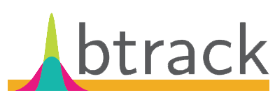

[](https://pypi.org/project/btrack)  [](https://pepy.tech/project/btrack)
[](https://github.com/psf/black)
[](https://github.com/quantumjot/BayesianTracker/actions/workflows/test.yml)
[](https://github.com/pre-commit/pre-commit)
[](https://btrack.readthedocs.io/en/latest/?badge=latest)
[](https://codecov.io/gh/quantumjot/BayesianTracker)

[docs]: https://btrack.readthedocs.io/en/latest/
[docs-dev]: https://btrack.readthedocs.io/en/latest/dev_guide/
[cellx]: http://lowe.cs.ucl.ac.uk/cellx.html



# Bayesian Tracker (btrack) :microscope::computer:

BayesianTracker (`btrack`) is a Python library for multi object tracking, used to reconstruct trajectories in crowded fields.
Here, we use a probabilistic network of information to perform the trajectory linking.
This method uses spatial information as well as appearance information for track linking.

The tracking algorithm assembles reliable sections of track that do not contain splitting events (tracklets).
Each new tracklet initiates a probabilistic model, and utilises this to predict future states (and error in states) of each of the objects in the field of view.
We assign new observations to the growing tracklets (linking) by evaluating the posterior probability of each potential linkage from a Bayesian belief matrix for all possible linkages.

The tracklets are then assembled into tracks by using multiple hypothesis testing and integer programming to identify a globally optimal solution.
The likelihood of each hypothesis is calculated for some or all of the tracklets based on heuristics.
The global solution identifies a sequence of high-likelihood hypotheses that accounts for all observations.

We developed `btrack` for cell tracking in time-lapse microscopy data.

[Read more about the science][cellx].

You can also --> :star: :wink:

## Installation

BayesianTracker has been tested with Python 3.7+ on OS X, Linux and Win10.


#### Installing the latest stable version

```sh
$ pip install btrack
```

## Installing on M1 Mac/Apple Silicon/osx-arm64

Best done with [conda](https://github.com/conda-forge/miniforge)

```sh
conda env create -f environment.yml
conda activate btrack
pip install btrack
```

## Usage examples

Visit [btrack documentation][docs] to learn how to use it and see other examples.

### Cell tracking in time-lapse imaging data

[](http://lowe.cs.ucl.ac.uk/cellx.html)
*Automated cell tracking and lineage tree reconstruction*. Visualization is provided by our plugin to Napari, [arboretum](https://btrack.readthedocs.io/en/latest/user_guide/napari.html).


[](https://youtu.be/EjqluvrJGCg)
*Video of tracking, showing automatic lineage determination*

---

## Development

The tracker and hypothesis engine are mostly written in C++ with a Python wrapper.
If you would like to contribute to btrack, you will need to install the latest version from GitHub. Follow the [instructions on our developer guide][docs-dev].


---
### Citation

More details of how this type of tracking approach can be applied to tracking cells in time-lapse microscopy data can be found in the following publications:

**Automated deep lineage tree analysis using a Bayesian single cell tracking approach**
Ulicna K, Vallardi G, Charras G and Lowe AR.
*Front in Comp Sci* (2021)
[](https://doi.org/10.3389/fcomp.2021.734559)


**Local cellular neighbourhood controls proliferation in cell competition**
Bove A, Gradeci D, Fujita Y, Banerjee S, Charras G and Lowe AR.
*Mol. Biol. Cell* (2017)
[](https://doi.org/10.1091/mbc.E17-06-0368)

```
@ARTICLE {10.3389/fcomp.2021.734559,
   AUTHOR = {Ulicna, Kristina and Vallardi, Giulia and Charras, Guillaume and Lowe, Alan R.},
   TITLE = {Automated Deep Lineage Tree Analysis Using a Bayesian Single Cell Tracking Approach},
   JOURNAL = {Frontiers in Computer Science},
   VOLUME = {3},
   PAGES = {92},
   YEAR = {2021},
   URL = {https://www.frontiersin.org/article/10.3389/fcomp.2021.734559},
   DOI = {10.3389/fcomp.2021.734559},
   ISSN = {2624-9898}
}
```

```
@ARTICLE {Bove07112017,
  author = {Bove, Anna and Gradeci, Daniel and Fujita, Yasuyuki and Banerjee,
    Shiladitya and Charras, Guillaume and Lowe, Alan R.},
  title = {Local cellular neighborhood controls proliferation in cell competition},
  volume = {28},
  number = {23},
  pages = {3215-3228},
  year = {2017},
  doi = {10.1091/mbc.E17-06-0368},
  URL = {http://www.molbiolcell.org/content/28/23/3215.abstract},
  eprint = {http://www.molbiolcell.org/content/28/23/3215.full.pdf+html},
  journal = {Molecular Biology of the Cell}
}
```
